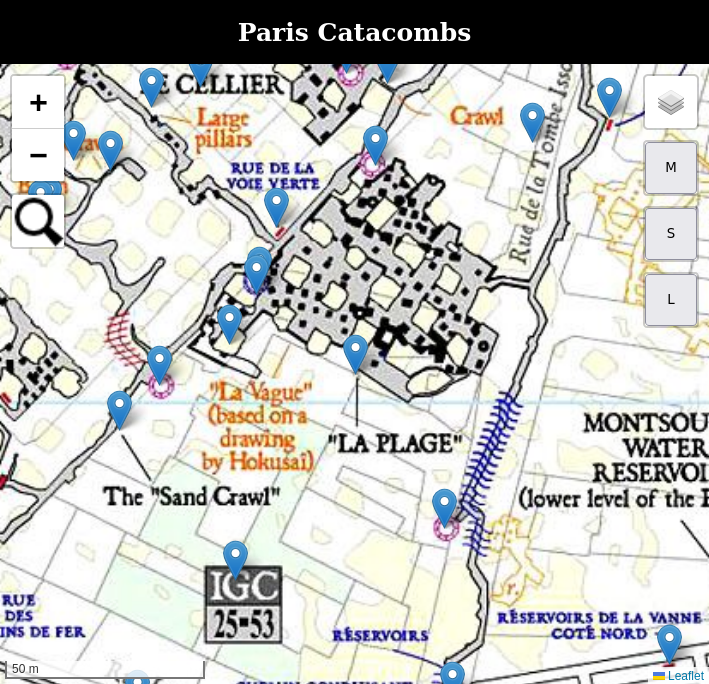

# Krazune's Hacky Paris Catacombs Map

**Do not use! Do not go into the catacombs! Do not use! Do not go into the catacombs! Do not use! Do not go into the catacombs! Do not use! Do not go into the catacombs! Do not use! Do not go into the catacombs! Do not use! Do not go into the catacombs! Do not use! Do not go into the catacombs! Do not use! Do not go into the catacombs! Do not use! Do not go into the catacombs! Do not use! Do not go into the catacombs! Do not use! Do not go into the catacombs! Do not use! Do not go into the catacombs! Do not use! Do not go into the catacombs! Do not use! Do not go into the catacombs! Do not use! Do not go into the catacombs!**

**The Golem will eat you** (he actually won't as he's a pretty cool guy, but you never know). **You have been warned.**

This is a very hacky interactable map of the Paris catacombs. There wasn't a lot of time to do this, so it isn't very well-made and is not optimized to save battery so don't depend solely on it (or at all) to know your way around the catacombs.

It is meant to be used (don't) on a phone without access to the internet or GPS, so you have to keep track of your position yourself. **_The real catacombs map is not included and must be added to the project manually_** (replaced by a black and pink placeholder image). This project is based on the most famous map from 2007 which is available online (google it - ACTUALLY DO NOT).

## Version

Current version: **2025.11.1**

_The version format is "\<year\>.\<zero padded month\>.\<build number starting at 1\>"._

## Main features

- Markers on most relevant points (grouped by category)
- Marker search
  - Powered by [Stefano Cudini's Leaflet Control Search](https://github.com/stefanocudini/leaflet-search) (donate to him, he deserves it)
- Path creation
- Path save
- Path load

## How to use (DO NOT!)

This is how you use this map on mobile:

1. Download this repository (direct link [here](https://github.com/Krazune/hacky-paris-catacombs-map/archive/refs/heads/master.zip))
2. Unzip it
3. Replace the placeholder ["catacombs.png"](source/images/catacombs.png) file with the real 2007 map (or any other version if you edit it into the correct size/position)
4. Transfer all the files to mobile
5. Start a local web server pointing to the transferred files (the [Simple HTTP Server](https://play.google.com/store/apps/details?id=com.phlox.simpleserver&hl=en) app can be used for this)
6. Access the configured URL (probably http://localhost:8080/)

It is possible to run this without a web server, but that requires all code and images to be included in a single html file.

## Issues

- Sometimes the map disappears 👻 (opening the map in incognito/anonymous mode mitigates this issue)
  - I am telling you, do not use this map, YOU WILL DIE (eventually)!
- Some markers might be missing
- No consistency in marker titles
- Hard to delete path points on mobile
- Sometimes new path points are created off-screen
- No real optimizations for battery usage
- Slow on old devices (hide all markers to solve this)
- Based on outdated map from 2007
- Will not save you when lost

## Dangers of the catacombs

- Disorientation
- Serious physical injury (bumping head on ceiling, sprained ankles, falls)
- Cave-ins
- Deep open pits/wells
- Drowning
- Hypothermia
- No signal to the outside world
- Humans
- Police fines 😱
- Other dangers include nausea, indigestion, diarrhea, headache, severe stomach bleeding or liver problems, more diarrhea, profound sedation, depression, coma, somebody else's diarrhea, and death. Contact your doctor immediately if you experience any of these symptoms.

## License

[MIT license](LICENSE)
